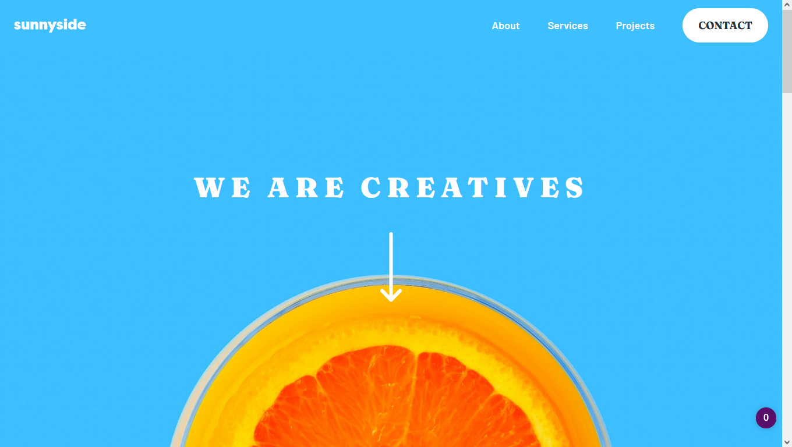

# Frontend Mentor - Sunnyside agency landing page solution

This is a solution to the [Sunnyside agency landing page challenge on Frontend Mentor](https://www.frontendmentor.io/challenges/sunnyside-agency-landing-page-7yVs3B6ef). Frontend Mentor challenges help you improve your coding skills by building realistic projects.

## Table of contents

-   [Overview](#overview)
    -   [The challenge](#the-challenge)
    -   [Screenshot](#screenshot)
    -   [Links](#links)
-   [My process](#my-process)
    -   [Built with](#built-with)
    -   [What I learned](#what-i-learned)
-   [Author](#author)

 

## Overview

### The challenge

Users should be able to:

-   View the optimal layout for the site depending on their device's screen size
-   See hover states for all interactive elements on the page

 

### Screenshot

Here are the screenshoot, you also can see the live version in the link section bellow 👇

 

 

### Links

-   Solution URL: [Give Me Your Thoughts](https://www.frontendmentor.io/challenges/sunnyside-agency-landing-page-7yVs3B6ef/hub/sunnyside-agency-landing-page-WlvMjzfxJ)
-   Live Site URL: [Click Here To See The Live Demo](https://bahree669.github.io/sunnyside-agency-frontend-mentor/)

 

## My process

### Built with

-   Semantic HTML5 markup
-   SCSS/SASS 💅
-   Flexbox
-   CSS Grid
-   Mobile-first workflow
-   JavaScript 💛

 

### What I learned

This challenge strengthen my CSS grid and CSS background skill. I learn a lot about the background property, how to make the background fit perfectly to the container, how to positioning it and a lot more. 😁

 

## Author

-   Frontend Mentor - [@Bahree669](https://www.frontendmentor.io/profile/Bahree669)
-   Twitter - [@Bahree69](https://www.twitter.com/Bahree69) 😊😁
